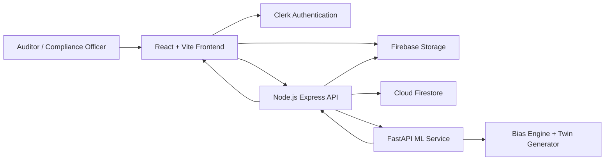

# Nyaay AI Bias Auditing Platform

Nyaay is a full-stack AI bias auditing prototype for India. It stress-tests algorithmic decision systems by generating synthetic applicant twins that are identical in merit but vary across Indian demographic dimensions such as caste-linked surnames, religion proxies, region, pincode and gender. The platform produces dashboards, statistical audit evidence, remediation guidance and compliance-ready reports.

This build follows the Solution Challenge prototype deck and PRD: a professional glassmorphism interface, Firebase-backed auth/data/storage architecture, Express API layer and FastAPI bias-analysis microservice.

## Authentication

Nyaay now uses **Clerk** for authentication. Add your Clerk publishable key to `frontend/.env`:

```env
VITE_CLERK_PUBLISHABLE_KEY=pk_test_...
```

If the key is missing, the prototype uses a local demo login so the UI can still run during judging or development.

## Google Services Used

- **Cloud Firestore**: persistence for users, uploads, audits, results, remediations and report metadata.
- **Firebase Storage**: secure CSV/XLS/XLSX upload storage for historical decision data.
- **Firebase Hosting**: optional static hosting for the Vite frontend.

These services keep the MVP deployable on Google's free or low-cost tiers while satisfying the hackathon requirement for Google service integration. Clerk is used specifically for auth because it is faster to configure for polished hackathon SSO and organisation workflows.

## Architecture



## Project Structure

```text
nyaay/
  frontend/      React, Vite, TailwindCSS, Framer Motion, Recharts
  backend/       Node.js, Express, Firebase Admin SDK
  ml-service/    FastAPI, pandas/numpy/scipy style bias computation
  firebase.json  Firebase Hosting, Firestore and Storage config
```

## Setup

### Frontend

```bash
cd nyaay/frontend
npm install
npm run dev
```

Create `frontend/.env` for real Firebase credentials:

```env
VITE_FIREBASE_API_KEY=
VITE_FIREBASE_AUTH_DOMAIN=
VITE_FIREBASE_PROJECT_ID=
VITE_FIREBASE_STORAGE_BUCKET=
VITE_FIREBASE_MESSAGING_SENDER_ID=
VITE_FIREBASE_APP_ID=
VITE_API_BASE=http://localhost:8080/api
VITE_CLERK_PUBLISHABLE_KEY=
```

### Upload Bias Check

The `/upload` page parses CSV, XLS and XLSX files in the browser. Map the model's decision column plus any available proxy columns:

- name/surname for caste or religion proxy checks
- pincode for region or religion proxy checks
- gender for gender checks

The prototype calculates approval-rate disparity between groups. When it finds a biased division, it reruns a counterfactual estimate by changing that division to the most common reference group and shows how many decisions would likely change. That demonstrates whether the model's historical decisions appear sensitive to the protected/proxy field.

You can also add custom bias fields during mapping. For example, if your file contains `school_board`, `college_tier`, `language`, `city`, `employment_type` or any domain-specific field, add it as a custom dimension and Nyaay will group outcomes by that column.

### Live AI Audit

The `/live-audit` page tests a live model with custom fields:

1. Define the field schema the target model needs.
2. Pick one protected/proxy field to change.
3. Generate a common/reference applicant and a counterfactual twin.
4. Send both payloads to the model.
5. Compare decisions.

For Ollama-backed local testing, install Ollama, pull a model, and run the backend:

```powershell
ollama pull llama3.1
ollama serve
```

Then set these in `backend/.env` if you want non-default values:

```env
OLLAMA_BASE_URL=http://localhost:11434
OLLAMA_MODEL=llama3.1
```

For any other AI provider, use **Custom API** on `/live-audit`:

1. Paste the provider endpoint.
2. Add headers as JSON.
3. Add the request body template.
4. Set the response text path.

The template supports:

```text
{{prompt}}
{{profileJson}}
```

For Gemini-style APIs, the default request template and response path are already shaped for `generateContent`. For a company model API, set the endpoint and body to whatever that API expects.

### Backend

```bash
cd nyaay/backend
npm install
$env:ALLOW_DEMO_AUTH="true"
npm run dev
```

For production, set:

```env
CLERK_SECRET_KEY=
CLERK_PUBLISHABLE_KEY=
FIREBASE_PROJECT_ID=
FIREBASE_STORAGE_BUCKET=
FIREBASE_SERVICE_ACCOUNT_JSON=
ML_SERVICE_URL=http://localhost:8000
CORS_ORIGIN=http://localhost:5173
```

### ML Service

```bash
cd nyaay/ml-service
python -m venv .venv
.venv\Scripts\activate
pip install -r requirements.txt
uvicorn main:app --reload --port 8000
```

## Core Routes

- `/` Landing page
- `/auth` Login and registration
- `/dashboard` Audit overview
- `/upload` Upload, map and validate decision data
- `/configure` Configure and launch audit
- `/results/:auditId` Statistical findings and raw twin outcomes
- `/remediation/:auditId` Fix guidance and resolution tracking
- `/reports` Compliance report preview and PDF export
- `/monitor` Continuous monitoring trends
- `/settings` Organisation profile and API key surface

## API Overview

- `POST /api/auth/register`
- `POST /api/auth/verify`
- `POST /api/uploads`
- `GET /api/uploads/:uploadId`
- `POST /api/audits`
- `GET /api/audits`
- `GET /api/audits/:id`
- `PATCH /api/audits/:id`
- `POST /api/audits/:id/run`
- `GET /api/audits/:id/results`
- `POST /api/reports/:auditId/export`

## Team Details

- Team name: Nyaay
- Problem statement: Unbiased AI Decision
- Prototype focus: India-native AI bias auditing with synthetic twins, statistical proof and compliance reporting.
