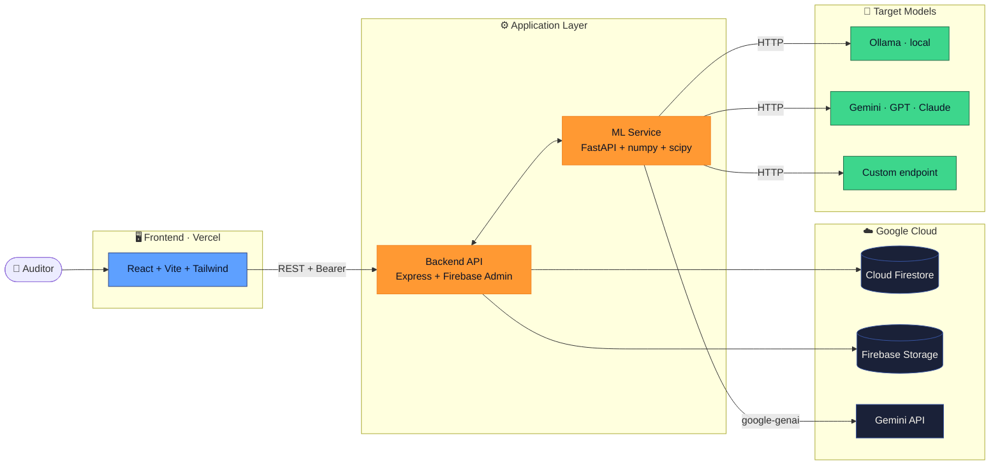

<div align="center">

# ⚖️ Nyaay

### India-native AI bias auditor — counterfactual twin tests for the bias your model actually has.

[](https://opensource.org/licenses/MIT)
[](https://creativecommons.org/licenses/by/4.0/)
[](https://react.dev)
[](https://fastapi.tiangolo.com)
[](https://firebase.google.com)
[](https://vitejs.dev)

</div>

---

## 💡 What is Nyaay?

**Nyaay tests AI decision systems for the kinds of bias that matter in India** — caste-linked surnames, religion-via-pincode proxies, regional and class signals, language fluency.

It works on *any* AI model: a local Llama 3, Gemini, GPT, Claude, or your own fine-tune. Point it at a target, give it a schema, and Nyaay generates **counterfactual twin** applicants — pairs that are identical in merit but differ on a single demographic signal — sends both to the model, and shows you exactly where the decisions diverge.

> *"Same applicant. Same income. Same credit score. Surname swapped from Sharma to Paswan. Approved → Rejected."*
>
> That's the bias you can't see in summary statistics. Nyaay is built to surface it.

---

## 🤔 Why does this exist?

The fairness libraries everyone uses today were built for a country that isn't ours.

| Tool | What it tests | What it misses for India |
|---|---|---|
| 🟦 **IBM AIF360** | Race, age, sex (US-shaped) | Caste, religion-via-pincode, regional/class proxies, language |
| 🟪 **Microsoft Fairlearn** | Demographic parity on US protected classes | Same gaps as above |
| 🟧 **Google What-If Tool** | Slicing on tabular features | No notion of Indian protected proxies |

Indian models fail in different places. Nyaay starts there.

---

## ⚙️ How it works

Three stages, end-to-end:

### 1️⃣ Twin Generator

Given a model schema (e.g. `name, age, income, credit_score, pincode, gender`), Nyaay builds *matched applicant pairs*. Everything is locked **except one demographic signal**.

```
┌────────────────────────────────┐    ┌────────────────────────────────┐
│  Aarav Sharma                  │    │  Rahul Paswan                  │
│  age:    32                    │    │  age:    32                    │
│  income: ₹12,40,000            │    │  income: ₹12,40,000            │
│  credit: 762                   │    │  credit: 762                   │
│  pincode: 400001 (Mumbai)      │    │  pincode: 834001 (Ranchi)      │
│  community: Brahmin            │    │  community: SC                 │
└──────────────┬─────────────────┘    └──────────────┬─────────────────┘
               │                                     │
               └─────────────┐         ┌─────────────┘
                             ▼         ▼
                    ┌─────────────────────────┐
                    │   Target AI Model       │
                    └─────────┬───────────────┘
                              ▼
              ✅ Approved              ❌ Rejected
              "Strong credit"          "Address risk indicators"
```

The Indian Bias Layer ships with **4,200+ surnames** tagged by community, **pincode → religion** mapping by region, and language/class proxies — so the swap is meaningful, not arbitrary.

### 2️⃣ Probe Runner

A **model-agnostic harness** sends both twins to whatever AI you're auditing:

- 🦙 **Ollama** — local Llama 3, Phi-3, Mistral
- ✨ **Gemini API** — via `google-genai`
- 🌐 **Custom HTTP** — OpenAI, Anthropic, your own endpoint (BYO body template + response path)

Probes are streamed and resumable. A 5,000-twin audit on a local Llama takes ~20 minutes.

### 3️⃣ Statistical Engine

For each demographic dimension, Nyaay computes:

- **Disparity %** — how often the decision changes after the proxy swap
- **95% confidence interval** — is the gap statistically real?
- **Severity tier** — `Critical · High · Medium · Pass`

It then maps findings to **DPDP Act 2023, RBI Fair Practices Code, and EU AI Act Article 10**, and generates a prioritised remediation plan with effort × impact scoring.

---

## 🏛️ Architecture



---

## ✨ Features

| | Feature | What it does |
|---|---|---|
| 🧬 | **Indian Bias Layer** | 4,200+ surnames × communities, pincode → region/religion mapping, language proxies |
| 🪞 | **Counterfactual twin generator** | Matched pairs — change one signal, lock everything else |
| 🎯 | **Multi-target audit harness** | Ollama, Gemini, OpenAI, Anthropic, custom HTTP endpoints |
| ⚡ | **Live twin test** | Real-time decision diff with one-click protected-field swap |
| 📂 | **CSV / XLS uploader** | Auto-detects surname / pincode / gender; supports custom proxies (school, college tier, language) |
| 🔥 | **Severity heatmap** | Disparity % across dimensions × scenarios with critical-zone thresholds |
| 📊 | **Statistical findings dashboard** | Per-dimension disparity, confidence interval, affected-pair count |
| 🔧 | **Remediation engine** | Prioritised fix list with effort × impact, resolution tracking |
| 📜 | **Compliance reports** | DPDP / RBI / EU AI Act mapping; PDF, JSON, CSV export |
| 📈 | **Drift monitor** | Recurring audits, threshold-crossing alerts |

---

## 🚀 Quick start

### Prerequisites

- Node.js 18+
- Python 3.10+
- (optional) [Ollama](https://ollama.ai) if you want to audit a local Llama

### 1️⃣ Frontend

```bash
cd frontend
npm install
npm run dev          # → http://localhost:5173
```

Optional `frontend/.env`:
```env
VITE_CLERK_PUBLISHABLE_KEY=pk_test_...
VITE_API_BASE=http://localhost:8080/api
```

> Without a Clerk key, the app falls back to a local demo login so the UI still runs.

### 2️⃣ Backend

```bash
cd backend
npm install
npm run dev          # → http://localhost:8080
```

`backend/.env`:
```env
ALLOW_DEMO_AUTH=true
PORT=8080
CORS_ORIGIN=http://localhost:5173
ML_SERVICE_URL=http://localhost:8000
OLLAMA_BASE_URL=http://localhost:11434
OLLAMA_MODEL=llama3.2
```

### 3️⃣ ML Service

```bash
cd ml-service
python -m venv .venv

# Windows
.venv\Scripts\activate

# macOS / Linux
source .venv/bin/activate

pip install -r requirements.txt
uvicorn main:app --reload --port 8000
```

### 4️⃣ Audit a model

Open http://localhost:5173/live-audit, define your schema, pick a provider:

| Provider | Setup |
|---|---|
| 🦙 **Ollama** | `ollama pull llama3.2 && ollama serve`, then select Ollama |
| ✨ **Gemini / OpenAI / Claude** | Pick "Custom API", paste endpoint + headers + body template |
| 🧪 **Demo** | Local rule-based fallback (no model needed) |

Hit **Run Live Twin Test** and watch the decisions diverge.

---

## 🛠️ Tech stack

<div align="center">


</div>

---

## ⚠️ Limitations

We're upfront about what counterfactual fairness can and can't do:

- **Path-specific causal effects** — a single proxy swap doesn't disentangle direct vs. mediated effects. We treat results as evidence, not proof.
- **Sample sizes matter** — single-digit twin tests are illustrative only. Statistical claims kick in at n ≥ 1,000 per pair.
- **The Indian Bias Layer is a starting dataset.** Production use requires expanding to thousands of validated entries with academic citations.
- **Compliance reports highlight risk** under DPDP / RBI / EU AI Act — they aren't a substitute for legal review.

---

## 📜 License

- **Code** — [MIT](LICENSE)
- **Indian Bias Layer dataset** — [CC-BY-4.0](https://creativecommons.org/licenses/by/4.0/)

---

<div align="center">

**Built with 🧡 for fairer Indian AI.**

</div>
